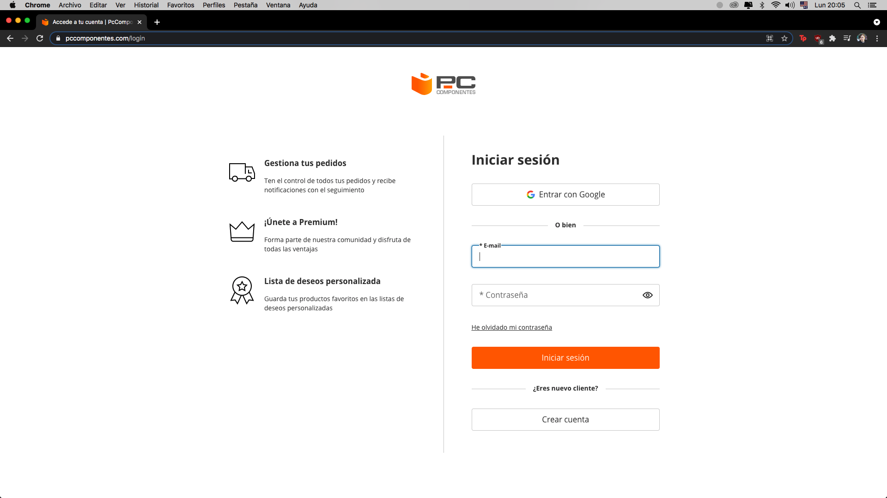
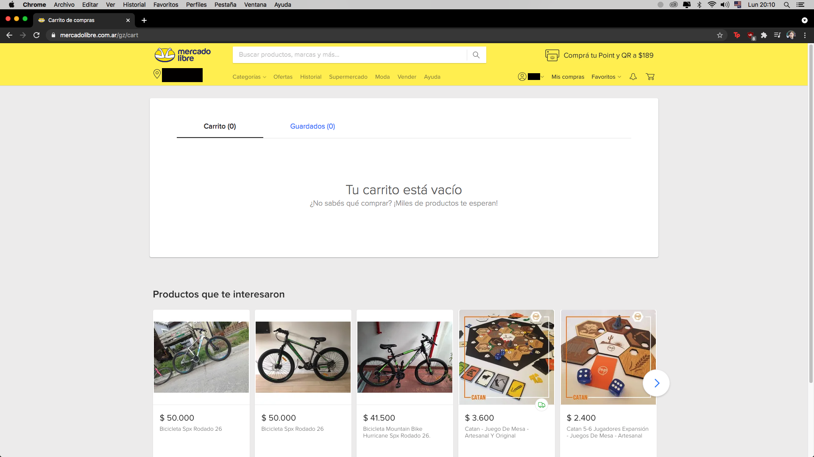

# MATech
___

## Acerca de
  ~~~
  Nuestro e-commerce se centra en vender componentes de PC.
  ~~~
___

## Publico objetivo
  ~~~
  Tanto gamers experimentados como personas que quieren adentrarse en el ambito del armado de 
  computadoras y PC-gaming.
  ~~~
___

## Integrantes
  - ### Teo Sordó
    ~~~
    Estudiante de Artes Multimediales. En mi tiempo libre me gusta tocar el bajo, ver películas,
    series, anime, jugar videojuegos o charlar con amigos.
    ~~~
  - ### Angélica Dutra
    ~~~
    Estudiante de Artes Multimediales en UNA. Hace 3 años descubrí la programación y ya no pude parar.
    ~~~
  - ### Matias Fabian Celentano
    ~~~
    Estudiante de Digital House, 21 años. Nuevo en el mundo de la programación.
    ~~~
___

## Referentes
  - [PC Componentes](https://www.pccomponentes.com/) -> **registro**

    
    
  - [HardGamers](https://www.hardgamers.com.ar/) -> **header**
    
    
  
  - [Newegg](https://www.newegg.com/global/ar-en/) -> **nav, carrousel y ofertas**
    
    
    
  - [Mercadolibre](https://www.mercadolibre.com.ar/) -> **login**
    
    
    
  - [Amazon](https://www.amazon.com/-/es/) -> **carrito**
  
    
___
